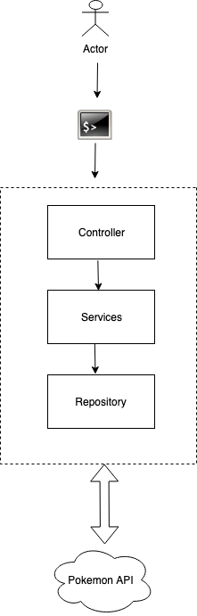
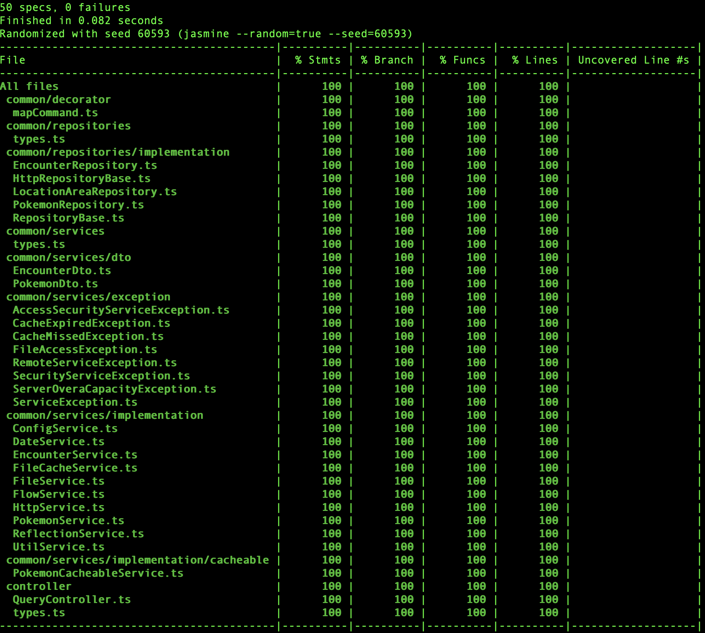

# Pokemon Terminal Query
a terminal gui to query and cache locally pokemon data

## Tools/Technologies use
* [Typescript](https://www.typescriptlang.org/ "link title")
* [Inversify Inversion Of Control](http://inversify.io/ "link title")
* [Jasmine Unit Test](https://jasmine.github.io/ "link title")
* [Nyc Test Coverage Framework](https://github.com/istanbuljs/nyc "link title")
* [nodemon](https://nodemon.io/ "link title")
* [NodeJS Reflection](https://developer.mozilla.org/en-US/docs/Web/JavaScript/Reference/Global_Objects/Reflect "link title")
* [Object Path Query](https://www.npmjs.com/package/object-path "link title")
* [Class Transformer](https://www.npmjs.com/package/class-transformer "link title")
* [TS Lint](https://www.npmjs.com/package/tslint "link title")
* [NodeJS Auto Format](https://www.npmjs.com/package/prettier "link title")

## Getting Started
check out the source code from github and compile

To Compile, go to the source folder and run
```
npm install
npm run build
```

To Run the query
```
node dist/app.js query <id/name>

#sample run
node dist/app.js query 1
node dist/app.js query bulbasaur
```

## Why use Layer Architecture
This arhitecture is use so that to minimize the effect of changing one component to the other. For example currently we are using text file as our data store and in later time should we decide to use Mongodb or mysql. We only have to update Repository Layer and the rest of the component don't needed to be updated.



to check for formatting issue
```
npm run lint
```

to check unit test coverage
```
npm test
```

#### Coverage
* Statement - 100 %
* Branch - 100 %
* Function - 100 %
* Line - 100 %

